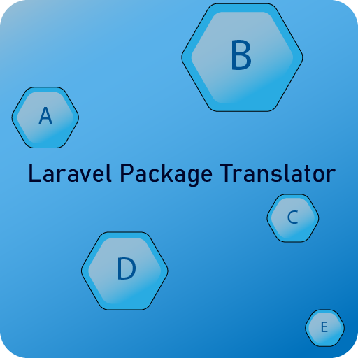
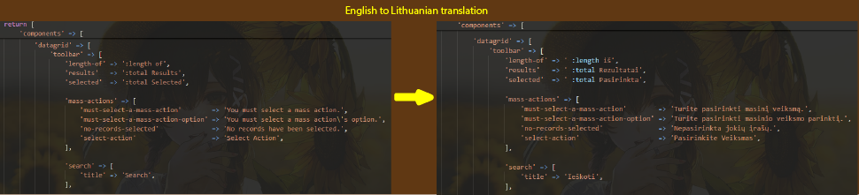
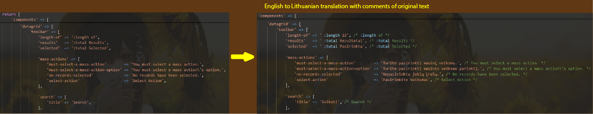
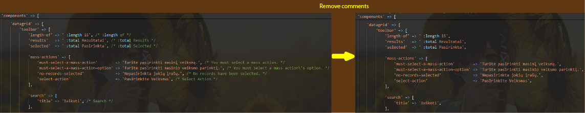

<h1 align="center">
    Laravel Package Translator
</h1>
<br/>
<div align="center">
  
</div>

Neat way to translate [Laravel](https://github.com/laravel/laravel) package documents with google translate. Highly recommend for [Bagisto](https://github.com/bagisto/bagisto) package development.
This package uses [stichoza/google-translate-php](https://github.com/Stichoza/google-translate-php) to translate.

## Installation

You can install the package via composer:

```bash
composer require gymmed/laravel-package-translator
```

## Usage

To use the command with arguments and options, follow this format:

```bash
package-translator:translate {package} {translateFrom} {translateTo} {--comments} {--force}
```

#### Explanation of Arguments:

-   {package}: The package path, e.g., Namespace/PackageName
-   {translateFrom}: Language code with source translation file, e.g., en/app
-   {translateTo}: Language code with target translation file, e.g., lt/app
-   {--comments}: (Optional) If you want to include comments.
-   {--force}: (Optional) If you want to force the operation.

usage example:

```bash
php artisan package-translator:translate Webkul/Shop en/app lt/app
```

will translate document from:

```bash
rootDirectory/packages/Webkul/Shop/src/Resources/lang/en/app.php
```

will create translated document in:

```bash
rootDirectory/packages/Webkul/Shop/src/Resources/lang/lt/app.php
```

returned results:

<div align="center">
  
</div>

You can translate and leave original text as comments for manual double checking:

```bash
php artisan package-translator:translate Webkul/Shop en/app lt/app --comments --force
```

Use --force option to overwrite document.

returned results:

<div align="center">
  
</div>

as code from:

```php
return [
  ...
  'datagrid' => [
      'toolbar' => [
          'length-of' => ':length of',
          'results'   => ':total Results',
          'selected'  => ':total Selected',

          'mass-actions' => [
              'must-select-a-mass-action'        => 'You must select a mass action.',
              'must-select-a-mass-action-option' => 'You must select a mass action\'s option.',
              'no-records-selected'              => 'No records have been selected.',
              'select-action'                    => 'Select Action',
          ],
        ...
];
```

to:

```php
return [
  ...
  'datagrid' => [
    'toolbar' => [
        'length-of' => ' :length iš', /* :length of */
        'results'   => ' :total Rezultatai', /* :total Results */
        'selected'  => ' :total Pasirinkta', /* :total Selected */

        'mass-actions' => [
            'must-select-a-mass-action'        => 'Turite pasirinkti masinį veiksmą.', /* You must select a mass action. */
            'must-select-a-mass-action-option' => 'Turite pasirinkti masinio veiksmo parinktį.', /* You must select a mass action\'s option. */
            'no-records-selected'              => 'Nepasirinkta jokių įrašų.', /* No records have been selected. */
            'select-action'                    => 'Pasirinkite Veiksmas', /* Select Action */
        ],
        ...
];
```

If you decide you don't want comments anymore, you can use:

```bash
package-translator:uncomment {package} {languageCodeAndFile}
```

example:

```bash
php artisan package-translator:uncomment Webkul/Shop lt/app
```

returned results:

<div align="center">
  
</div>
