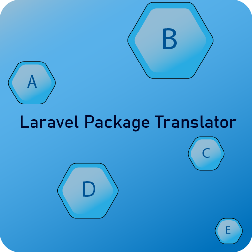

<h1 align="center">
    Laravel Package Translator
</h1>
<br/>
<div align="center">
  
</div>

Neat way to translate [Laravel](https://github.com/laravel/laravel) package documents with google translate. Highly recommend for [Bagisto](https://github.com/bagisto/bagisto) package development.
This package uses [stichoza/google-translate-php](https://github.com/Stichoza/google-translate-php) to translate.

## Installation

You can install the package via composer:

```bash
composer require gymmed/laravel-package-translator
```

## Usage

To use the command with arguments and options, follow this format:

```bash
package-translator:translate {package} {translateFrom} {translateTo} {--comments} {--force}
```

#### Explanation of Arguments:

{package}: The package path, e.g., Namespace/PackageName
{translateFrom}: The source translation file, e.g., en/app
{translateTo}: The target translation file, e.g., lt/app
{--comments}: (Optional) If you want to include comments.
{--force}: (Optional) If you want to force the operation.

usage example:

```bash
php artisan package-translator:translate Webkul/Shop en/app lt/app
```

returned results:

<div align="center">
  
</div>

You can translate and leave original text as comments for manual double checking:

```bash
php artisan package-translator:translate Webkul/Shop en/app lt/app --comments --force
```

Use --force option to overwrite document.

returned results:

<div align="center">
  
</div>

If you decide you don't want comments anymore, you can use:

```bash
package-translator:uncomment {package} {languageCodeAndFile}
```

example:

```bash
php artisan package-translator:uncomment Webkul/Shop lt/app
```

returned results:

<div align="center">
  
</div>
